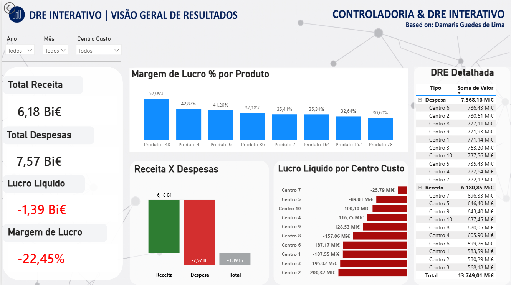

# Dashboard de DRE Interativo & Controladoria Financeira

 

## Visão Geral do Projeto
Este projeto consiste em uma solução completa de **Business Intelligence e Controladoria** para análise de Demonstrações do Resultado do Exercício (DRE). O painel foi projetado para permitir que executivos e gestores financeiros identifiquem rapidamente gargalos operacionais, margens por produto e centros de custo com desempenho negativo.

---

## Funcionalidades & Análises

* **Painel de KPIs:** Acompanhamento de *Receita Total*, *Despesa Total*, *Lucro Líquido* e *Margem de Lucro %*.
* **Top Products (Margem %):** Análise do Top 8 produtos com maior margem de lucro operacional.
* **Fluxo de Resultado (Waterfall Chart):** Mapeamento claro da transição entre Receita, Despesas e o Resultado do Período.
* **Causa Raiz de Prejuízo:** Análise por centro de custo para rápida identificação de áreas que demandam corte ou otimização de custos.
* **DRE Detalhada (Matriz):** Visão contábil em formato hierárquico (drill-down) com suporte a abertura de contas.

---

## Principais Medidas DAX Desenvolvidas

```dax
// 1. Receita Total
Total Receita = 
CALCULATE(
    SUM(Fato_Financeiro_10000[Valor]), 
    Fato_Financeiro_10000[Tipo] = "Receita"
)

// 2. Despesa Total
Total Despesa = 
CALCULATE(
    SUM(Fato_Financeiro_10000[Valor]), 
    Fato_Financeiro_10000[Tipo] = "Despesa"
)

// 3. Lucro Líquido
Lucro Liquido = [Total Receita] - [Total Despesa]

// 4. Margem de Lucro %
Margem de Lucro % = DIVIDE([Lucro Liquido], [Total Receita], 0)
